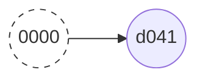
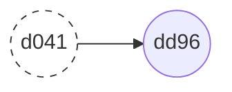
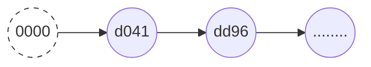
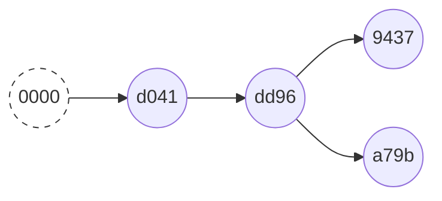
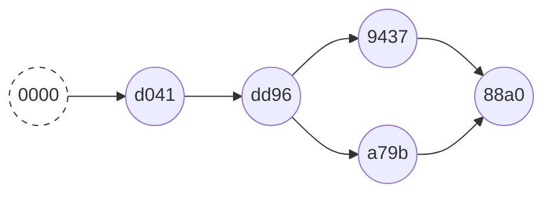
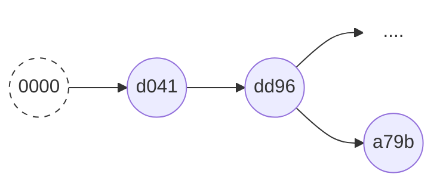
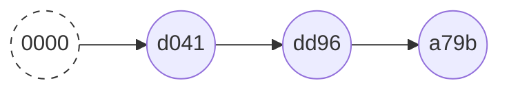

<div class="mb-4 absolute bottom-4 left-12">
  <span class="text-6xl text-primary-lighter text-opacity-80" style="font-weight:500;" >
    Get Along With
  </span>
  <div class="text-9xl text-white text-opacity-60" style="font-weight:600;" >
    Git  <light-icon icon="git-branch"/>
  </div> 
</div>

---
layout: image-right
equal: false
---

<div class="text-5xl font-bold text-primary pb-4">Who is Sugit?!</div>


<div class="blend" style="display:flex" >
  
  <p> <a href="https://twitter.com/sugitlab">@sugitlab</a>: 自称フルペラットエンジニア </p>
</div>

<br>
<br>

- 🍵 **Kyoto** - 京都にある会社で研究寄りのエンジニアやってます
  - 化学 + 数学 + プログラミング がお仕事です
  - 最近は PdM なお仕事が多め (´・ω・｀)
- 🧑‍💻 **Flutter** - プライベートの時間は大体 Flutter やってます
- 🗞 **[Zenn](https://zenn.dev/sugitlab)** - Flutter のことばかり書いている Zenn アカウントです
- 🚃 **[TechTrain](https://techbowl.co.jp/techtrain/mentors/116)** - 副業で U30 向けのメンターやってます。
  - U30なら無料なので興味あればぜひ

<style>
.blend {
  display: grid;
  place-items: center;
}

.blend img {
  mix-blend-mode: multiply;
  max-width: 300px;
  height: auto;
}

ul {
  list-style-type: circle;
}
</style>

---
layout: image-right
---

<div class="text-5xl font-bold text-primary pb-4">Thanks <light-icon icon="color-picker" /> </div>

<div class="text-xl">
  事前アンケートへのご協力ありがとうございました
</div>

---
layout: center-image
---

<div class="text-5xl font-bold text-primary pb-4">Questionnaire Results</div>

- "git-flow という運用パターンとその Pros, Cons" : 11
- "git のちょっと踏み込んだ使い方" : 10
- "git でやらかさないためにすること" : 10
- "そもそも VCS (Version Control System) のことについて知っていますか？" : 10
- "git が管理している .git フォルダの中身を見たことがありますか？" : 10
- "git におけるマージは 2 種類ある" : 9
- "GitHub の Issue でやってほしくないこと" : 9
- "OSS コントリビューションマナー" : 7

<style>
ul {
  text-align: left;
  list-style-type: circle;
  font-size: 1.3rem;
}
</style>

---
layout: center-image
---

- "git やらかしと対処法" : 6
- "VSC と VCS Hosting Service のことについて知っていますか？" : 6
- "Git Client (GUI, TUI, CLI tool) のおすすめたち" : 5
- "ローカルとリモートをちゃんと理解する" : 5
- "GitHub における Markdown 文化とお作法" : 5
- "git の四方山話 (歴史など)" : 2
- "git の基本的な使い方" : 1

<style>
ul {
  text-align: left;
  list-style-type: circle;
  font-size: 1.3rem;
}
</style>

---
layout: center-image
---

<div class="text-3xl font-bold">早速ですが質問です</div>

---
layout: center-image
---

<div class="text-5xl font-bold">どうして Git を使っているのですか??</div>


---
layout: center-image
---

<div class="text-5xl font-bold">Git以外...選択肢あるの? 🤔</div>

<br>

<v-click>
  <div class="text-4xl font-bold">安心してください。Git でOKです 💁🏻‍♂️</div>
</v-click>

---
layout: center-image
---

<div class="text-2xl font-bold leading-relaxed">
  ソースコードを管理するなら、現時点での最善はGitだと思います <br>
  しかし、まだまだ Git ではない現場というのもあるのです… 
</div>

---
layout: center-image
---

<div class="text-2xl font-bold leading-relaxed">
  これに対して<br>
  「なんだ、時代遅れの会社か 🤷🏼‍♂️」<br>
  と言う人は、大体何もわかってない人です。<br>
  無視しましょう🙆‍♂️
</div>

---
layout: center-image
---

<div class="text-2xl font-bold leading-relaxed">
  どうして Git が使われているのか <br>
  Git以外の選択肢は何があるのか <br>
  余談ですが少〜しお付き合いください
</div>

---
layout: center-image
---

<div class="text-5xl font-bold text-primary pb-4">What's VCS</div>

<div class="text-3xl"> Version Control System </div>

<div class="rounded-2xl border-4 border-green-200 p-4 m-8">
  電子的なファイルの変更履歴を残しておき、<br>
  過去の状態に戻したり変更内容を確認できるようにするソフトウェアの総称
</div>

音楽・写真・テキスト・書類 など<span style="color:red;">電子的な記録全て</span>が対象

数ある VCS ソフトウェアのうちの１つがみんな大好き <span style="font-size:32px">Git</span> です

---
layout: center-image
---

<div class="text-2xl m-8">
Git 以外にも有名なバージョン管理システムがいくつかあります<br>
いまでも選択肢に上がる現役バリバリなものは以下の3つです
</div>

<div class="text-3xl font-bold text-primary pb-4">
Git / Subversion / Mercurial
</div>

といっても、Mercurial を使っている人をみたことがないので<br>

実質 Git vs Subversion です。

---
layout: center-image
image: 'https://gyazo.com/bca93c9f18f08f3da2db9058b405ba71'
---

<div class="text-4xl text-primary font-bold m-4">
Google Trends
</div>

---
layout: center-image
---

<div class="text-2xl mb-8 leading-relaxed">
  ご覧の通り Git が流行る前は Subversion が最強でした🏋️‍♀️
</div>

<div class="text-2xl mb-8 leading-relaxed">
  まだ Subversion が現役の組織もたくさんあります (弊社でも現役です)<br>
</div>

<div class="text-2xl mb-8 leading-relaxed">
  では、なぜここまで Git が普及したのでしょう
</div>

---
layout: image-right
image: 'https://upload.wikimedia.org/wikipedia/commons/thumb/0/01/LinuxCon_Europe_Linus_Torvalds_03_%28cropped%29.jpg/440px-LinuxCon_Europe_Linus_Torvalds_03_%28cropped%29.jpg'
equal: false
---


<div class="text-2xl mb-8 leading-relaxed">
もともと Git は Linux 開発者の Linus Tovalds が

<br><br>
「オープンソースでLinux作りたいんだけど

　良いVCSないわ〜、作るわ〜」
<br><br>


と言い出してサクサク作ったものだそうです

（二週間で作ったという話です… 🙈）
</div>


<v-click>

<div class="text-3xl mb-8 leading-relaxed">
  そう、オープンソースのために作ったのです。
</div>

</v-click>

---
layout: center-image
---

<div class="text-4xl font-bold">
  どうしてオープンソースにはGitが良いの？
</div>

---
layout: image-left
image: 'https://gyazo.com/1057a847ce0b0e71b693d725a61da455'
equal: false
---

<div class="text-2xl font-bold">
  Git は 分散型 だからです
</div>

---
layout: image-right
image: 'https://gyazo.com/9bd97cf0c60ba885cc02fb132c0083f2'
equal: false
---

<div class="text-2xl font-bold">
  一方、Subversion は 中央集中型 と呼ばれます
</div>

---
layout: image-left
image: 'https://gyazo.com/689031935c80e501b976af1812af629f'
---

<div class="text-4xl text-primary font-bold m-4">
Git
</div>

参加者全員がリポジトリをもちます

```shell
$ git clone ...
```

っていうアレです

---
layout: image-left
image: 'https://gyazo.com/00a1aa8aa3c4b04f93eb001d13cd3bbc'
---
<div class="text-4xl text-primary font-bold m-4">
Subversion
</div>

<br>

参加者はリポジトリをもちません

ファイルをもらって、変更して、登録します


---
layout: center-image
---

<div class="text-2xl font-bold">
オープンソースで Subversionを使うと<br><br>

みんなで１箇所のサーバーに集中アクセスすることになります<br><br>

ログを見るだけでもサーバーにアクセスです <br><br>

サーバー死んじゃう！！😨
</div>

---
layout: center-image
---

<div class="text-3xl font-bold leading-relaxed">
　じゃあ Git 最強やん
</div>

---
layout: center-image
---


<div class="text-5xl font-bold pb-4 mb-8">
  Git is Champion?
</div>

<div class="text-5xl font-bold pb-4">
  🙅 NO 🙅
</div>

---
layout: center-image
---


<div class="text-5xl font-bold pb-4 mb-8">
  Git + GitHub is Champion!!
</div>

<div class="text-5xl font-bold pb-4">
  🙆‍♂️ YES 🙆‍♂️
</div>

<br><br>
知らんけど 🤪


---
layout: center-image
---

<div class="text-5xl font-bold text-primary pb-4 mb-8">
  GitHub <light-icon icon="brand-github" /> makes Git <light-icon icon="git-merge" />  Champion
</div>


<div class="text-xl">
GitHub の登場によってオープンソース活動が世の中に急速に拡大しました。

その結果「Git 最強じゃね？」となったのです。
</div>

---
layout: center-image
image: 'https://gyazo.com/bca93c9f18f08f3da2db9058b405ba71'
---

<div class="text-2xl mb-8">
GitHubのサービススタートが2010年です

Gitの大逆転が始まっていますね
</div>

---
layout: center-image
---

<div class="text-3xl font-bold">長くなりましたが四方山話はこれでおしまいです</div>

---
layout: center-image
---

<div class="text-3xl font-bold">実用的な話をしましょう</div>

---
layout: center-image
---

<div class="text-3xl font-bold">実用的な話をしましょう</div>

---
layout: center-image
---

<div class="text-2xl">
  適当なフォルダで git log とたたくと
</div>

```shell
fatal: not a git repository (or any of the parent directories): .git
```
<div class="text-2xl">
  と怒られます
</div>

---
layout: center-image
---
<div class="text-5xl">
  not a git repository 
</div>

---
layout: center-image
---
<div class="text-4xl">
  gitリポジトリって何か分かりますか?
</div>


---
layout: center-image
---
<div class="text-4xl">
  git commit って何か分かりますか?
</div>

---
layout: center-image
---
<div class="text-4xl">
  分からなくなってきませんか? 😵‍💫
</div>

---
layout: center-image
---
<div class="text-4xl">
  実際 分からなくてもコードはかけます 🤫
</div>


---
layout: center-image
---
<div class="text-4xl mb-8">
  Gitの仕組みがわかると...🤔
</div>

<v-click>
  <div class="text-4xl">
    Gitの操作に自信が出る 😎
  </div>
</v-click>

---
layout: center-image
---

<div class="text-4xl font-bold text-primary mb-8">
.git の中身を見てみよう
</div>

.git ?? 🤔

---
layout: center-image
image: 'https://gyazo.com/239107de6b5d59a372531fc380c080d2'
---

<div class="text-3xl font-bold mb-8">
Gitリポジトリであるかどうか...
</div>
<div class="text-3xl font-bold mb-8">
それは .git があるかどうかです!
</div>

---
layout: center-image
---

<div class="text-2xl">
.git は Git リポジトリの情報をすべて保持している隠しフォルダです
</div>

---
layout: image-right
---

<div class="text-5xl text-primary font-bold mb-8">
  Unpack the .git
</div>

<br>

`git init` から見ていきましょう

---
layout: center-image
---

```shell
~/.git $ tree -L 1
├── HEAD
├── config
├── description
├── hooks
├── info
├── objects
└── refs
8 directories, 17 files
```
<div class="text-xl">
git init で作った git リポジトリです

さっそく README.md をつくってコミットしてみましょう
</div>


---
layout: center-image
---

```shell {all|4}
~/gitdir $ echo test > README.md  <-- README.mdを作って
~/gitdir $ git add README.md  <-- ステージングにして
~/gitdir $ git commit -m "initialize repository"  <-- コミット
[master (root-commit) d041e09] initialize repository
 1 file changed, 1 insertion(+)
 create mode 100644 README.md
```

<v-click>
  <div class="text-xl">
  最初のコミットができました
  </div>
</v-click>

---
layout: center-image
---

```shell {all}
~/.git $ tree
// ~~~省略~~~
├── logs
│   ├── HEAD
│   └── refs
│       └── heads
│           └── master
├── objects
│   ├── 9d
│   │   └── aeafb9864cf43055ae93beb0afd6c7d144bfa4
│   ├── c1
│   │   └── 2d7c0ed49ad9c7aa938743ba6fdee54b6b7fe1
│   ├── d0
│   │   └── 41e090b548f4ab7c11848384f9e171e728fc3d
│   ├── info
│   └── pack
└── refs
    ├── heads
    │   └── master
    └── tags
```

<div class="text-xl">
  なんかいろいろ増えました
</div>

---
layout: image-right
---

```shell {all|1}
[master (root-commit) d041e09] initialize repository
 1 file changed, 1 insertion(+)
 create mode 100644 README.md
```

```shell {all|6-7}
├── objects
│   ├── 9d
│   │   └── aeafb9864cf43055ae93beb0afd6c7d144bfa4
│   ├── c1
│   │   └── 2d7c0ed49ad9c7aa938743ba6fdee54b6b7fe1
│   ├── d0
│   │   └── 41e090b548f4ab7c11848384f9e171e728fc3d
│   ├── info
│   └── pack
```

<v-click>
  <div class="text-xl">
    おや、一致した ID が見つかりましたね
  </div>
</v-click>

---
layout: center-image
---

```shell
├── d0
    └── 41e090b548f4ab7c11848384f9e171e728fc3d
```

<div class="text-2xl">
  解析してみましょう
</div>


---
layout: center-image
---

<div class="text-xl mb-4">
  git cat-file で解析できます
</div>

```shell {all|2}
$ git cat-file -p d041 <-- 最初4文字くらいでOK
tree c12d7c0ed49ad9c7aa938743ba6fdee54b6b7fe1
author SuGit <sgmt.snj@gmail.com> 1626708424 +0900
committer SuGit <sgmt.snj@gmail.com> 1626708424 +0900
```

<v-click>

```shell {4-5}
├── objects
│   ├── 9d
│   │   └── aeafb9864cf43055ae93beb0afd6c7d144bfa4
│   ├── c1
│   │   └── 2d7c0ed49ad9c7aa938743ba6fdee54b6b7fe1
│   ├── d0
│   │   └── 41e090b548f4ab7c11848384f9e171e728fc3d
│   ├── info
│   └── pack
```

おや??

</v-click>

---
layout: center-image
---

```shell {all|2}
$ git cat-file -p c12d
100644 blob 9daeafb9864cf43055ae93beb0afd6c7d144bfa4    README.md
```

<v-click>

```shell {2-3}
├── objects
│   ├── 9d
│   │   └── aeafb9864cf43055ae93beb0afd6c7d144bfa4
│   ├── c1
│   │   └── 2d7c0ed49ad9c7aa938743ba6fdee54b6b7fe1
│   ├── d0
│   │   └── 41e090b548f4ab7c11848384f9e171e728fc3d
│   ├── info
│   └── pack
```

ほう...

</v-click>

---
layout: center-image
---

```shell
$ git cat-file -p 9dae
test
```

<div class="text-xl">
  なんか見えてきましたね
</div>

---
layout: center-image
---

```shell
├── 9d
│   └── aeafb9864cf43055ae93beb0afd6c7d144bfa4
├── c1
│   └── 2d7c0ed49ad9c7aa938743ba6fdee54b6b7fe1
├── d0
│   └── 41e090b548f4ab7c11848384f9e171e728fc3d
```
これがこう
```shell
$ git cat-file -p 9dae
test
$ git cat-file -p c12d
100644 blob 9daeafb9864cf43055ae93beb0afd6c7d144bfa4    README.md
$ git cat-file -p d041
tree c12d7c0ed49ad9c7aa938743ba6fdee54b6b7fe1
author SuGit <sgmt.snj@gmail.com> 1626708424 +0900
committer SuGit <sgmt.snj@gmail.com> 1626708424 +0900
```
順番に見ていきましょう

---
layout: center-image
---


<div class="text-3xl font-bold text-primary mb-4">
  type: commit
</div>

<div class="text-xl rounded-2xl border-4 border-green-200 p-4 m-8 text-left">
  <div class="text-xl font-bold">$ git cat-file -p d041</div>
  tree <span class="text-red-500">c12d</span>7c0ed49ad9c7aa938743ba6fdee54b6b7fe1<br>
  <div class="text-sm">// c12d のツリーにコミットをつんだよ</div>
  <span class="text-green-500">author</span> SuGit &lt;sgmt.snj@gmail.com&gt; 1626708424 +0900<br>
   <div class="text-sm">// コミットの著者は SuGit だよ</div>
   <div class="text-sm">// 時刻は 1626708424 +0900 = 2021/7/20 00:27:04 だよ (UNIX時間)</div>
  <span class="text-green-500">committer</span> SuGit &lt;sgmt.snj@gmail.com&gt; 1626708424 +0900
   <div class="text-sm">// コミッターは... 以下同文</div>
</div>

---
layout: center-image
---


<div class="text-3xl font-bold text-primary mb-4">
  type: tree
</div>

<div class="text-xl rounded-2xl border-4 border-green-200 p-4 m-8 text-left">
  <div class="text-xl font-bold">$ git cat-file -p c12d</div>
  100644 blob <span class="text-red-500">9dae</span>afb9864cf43055ae93beb0afd6c7d144bfa4    README.md
  <div class="text-sm">// README.md を圧縮して 9dae に保存したよ</div>
</div>

---
layout: center-image
---


<div class="text-3xl font-bold text-primary mb-4">
  type: blob
</div>

<div class="text-xl rounded-2xl border-4 border-green-200 p-4 m-8 text-left">
  <div class="text-xl font-bold">$ git cat-file -p 9dae</div>
  <span class="text-red-500">test</span>
  <div class="text-sm">// README.md の中身だよ</div>
</div>

---
layout: center-image
---

<div class="text-3xl font-bold text-primary mb-4">
  つまり
</div>

- commit: コミットの情報
- tree: コミット履歴の情報
- blob: ファイルのバックアップ

<style>
ul {
  text-align: left;
  list-style-type: circle;
  font-size: 1.3rem;
}
</style>


---
layout: center-image
---

<div class="text-xl font-bold mb-4">
  次はログをみましょう
</div>

```shell {4-7}
~/.git $ tree
// ~~~省略~~~
├── logs
│   ├── HEAD
│   └── refs
│       └── heads
│           └── master
├── objects
│   ├── 9d
│   │   └── aeafb9864cf43055ae93beb0afd6c7d144bfa4
│   ├── c1
│   │   └── 2d7c0ed49ad9c7aa938743ba6fdee54b6b7fe1
│   ├── d0
│   │   └── 41e090b548f4ab7c11848384f9e171e728fc3d
│   ├── info
│   └── pack
└── refs
    ├── heads
    │   └── master
    └── tags
```

---
layout: center-image
---

<div class="text-xl font-bold mb-4">
log を見たいので、コミットをもう一度追加しておきましょう
</div>

README.md

```md
- test
+ # Abs.
+  This repository is just for testing the git behaviour
```

<v-click>

```shell
~/gitdir $ git add README.md
~/gitdir $ git commit -m "update README.md"
[master dd96c8f] update README.md
1 file changed, 3 insertions(+), 1 deletion(-)
```

</v-click>

---
layout: center-image
---

```shell {all|2-6}
~/gitdir$ git log
commit dd96c8f8bbcff86922b3db1f94aa38c4c6f3d633 (HEAD -> master)
Author: Sugit <sgmt.snj@gmail.com>
Date:   Tue Jul 20 01:09:32 2021 +0900

    update README.md

commit d041e090b548f4ab7c11848384f9e171e728fc3d
Author: SuGit <sgmt.snj@gmail.com>
Date:   Tue Jul 20 00:27:04 2021 +0900

    initialize repository
```

<div class="text-xl font-bold mb-4">
新しいコミットが増えました
</div>
 
---
layout: center-image
---

```shell
~/.git/logs $ tree
├── HEAD
└── refs
    └── heads
        └── master

~/.git/logs $ cat HEAD
0000000000000000000000000000000000000000
d041e090b548f4ab7c11848384f9e171e728fc3d
SuGit <sgmt.snj@gmail.com> 1626708424 +0900
commit (initial): initialize repository

d041e090b548f4ab7c11848384f9e171e728fc3d
dd96c8f8bbcff86922b3db1f94aa38c4c6f3d633
Sugit <sgmt.snj@gmail.com> 1626710972 +0900
commit: update README.md
```

<div class="text-xl font-bold mb-4">
これがログです
</div>


---
layout: center-image
---

<div class="text-xl font-bold mb-4">
分解すると
</div>

```shell
0000000000000000000000000000000000000000 ## <- 1つ前のコミットハッシュ
d041e090b548f4ab7c11848384f9e171e728fc3d ## <- 自身のコミットハッシュ
SuGit <sgmt.snj@gmail.com> 1626708424 +0900 ## <- コミット情報
commit (initial): initialize repository with ## <- メッセージ
```

となっています

---
layout: center-image
---

<div class="text-5xl text-primary font-bold mb-4">
1つ前のコミットハッシュ
</div>

---
layout: center-image
---



```shell
0000000000000000000000000000000000000000 ## <- 1つ前のコミットハッシュ
d041e090b548f4ab7c11848384f9e171e728fc3d ## <- 自身のコミットハッシュ
SuGit <sgmt.snj@gmail.com> 1626708424 +0900 ## <- コミット情報
commit (initial): initialize repository  ## <- メッセージ
```



```shell
d041e090b548f4ab7c11848384f9e171e728fc3d
dd96c8f8bbcff86922b3db1f94aa38c4c6f3d633
Sugit <sgmt.snj@gmail.com> 1626710972 +0900
commit: update README.md
```

---
layout: center-image
---

<div class="text-2xl font-bold mb-8">
  コミットは「自身のハッシュ値」と「ひとつ前のハッシュ値」を持ちます
</div>

<div class="text-2xl font-bold mb-4">
git graph はこの連結によって作られます
</div>



---
layout: center-image
---

<div class="text-3xl font-bold mb-4">
これを踏まえて、いろいろなコマンドをみていきましょう
</div>

---
layout: center-image
---

<div class="text-3xl text-primary font-bold mb-4">
git branch test
</div>

<div class="text-xl">
test ブランチの作成<br>
実態は・・・
</div>

---
layout: center-image
---

<div class="text-3xl text-primary font-bold mb-4">
コミットハッシュに名前をつけて保存しただけ
</div>

<div class="text-xl rounded-2xl border-4 border-green-200 p-4 m-8 text-left">
~/.git/refs/heads $ cat test <br>
dd96c8f8bbcff86922b3db1f94aa38c4c6f3d633
</div>


<arrow x1="480" y1="430" x2="450" y2="390" color="#99f" width="2" arrowSize="1" />
test

---
layout: center-image
---

<div class="text-3xl text-primary font-bold mb-4">
git commit --amend -m "hogehoge"
</div>

<div class="text-xl">
コミットの修正は単に log を書き換えているだけ
</div>

```shell
0000000000000000000000000000000000000000 ## <- 1つ前のコミットハッシュ
d041e090b548f4ab7c11848384f9e171e728fc3d ## <- 自身のコミットハッシュ
SuGit <sgmt.snj@gmail.com> 1626708424 +0900 ## <- コミット情報
commit (initial): initialize repository ## <- メッセージ　<-- ここを書き換える
```

---
layout: center-image
---

<div class="text-3xl text-primary font-bold mb-4">
git merge test
</div>

test ブランチのマージは...?

---
layout: center-image
---

<div class="text-lg m-8">
それぞれが独自に進化している場合
</div>

master
<arrow x1="520" y1="220" x2="630" y2="260" color="#f99" width="2" arrowSize="1" />

test
<arrow x1="520" y1="420" x2="630" y2="380" color="#99f" width="2" arrowSize="1" />

---
layout: center-image
---

<div class="text-lg m-8">
マージコミットが増えて... master の位置が変わります
</div>

master
<arrow x1="520" y1="220" x2="700" y2="300" color="#f99" width="2" arrowSize="1" />

test
<arrow x1="520" y1="420" x2="580" y2="390" color="#99f" width="2" arrowSize="1" />

---
layout: center-image
---

<div class="text-lg m-8">
testだけが進化している場合
</div>

master
<arrow x1="500" y1="240" x2="540" y2="280" color="#f99" width="2" arrowSize="1" />

test
<arrow x1="520" y1="420" x2="630" y2="380" color="#99f" width="2" arrowSize="1" />

---
layout: center-image
---

<div class="text-lg m-8">
git merge しても masterの位置が変わるだけです
</div>

master
<arrow x1="520" y1="270" x2="600" y2="300" color="#f99" width="2" arrowSize="1" />

test
<arrow x1="510" y1="370" x2="600" y2="350" color="#99f" width="2" arrowSize="1" />


---
layout: center-image
---

<div class="text-3xl text-primary font-bold m-8">
Git のマージが 2 種類ありますね
</div>

アンケートの内容をやっと回収 🤫


---
layout: center-image
---

hogehoge
