<div class="mb-4 absolute bottom-4 left-12">
  <span class="text-6xl text-primary-lighter text-opacity-80" style="font-weight:500;" >
    Get Along With
  </span>
  <div class="text-9xl text-white text-opacity-60" style="font-weight:600;" >
    Git  <light-icon icon="git-branch"/>
  </div> 
</div>

---
layout: center-image
---

<div class="text-3xl">早速ですが質問です</div>

---
layout: center-image
---

<div class="text-5xl">どうして Git を使っているのですか??</div>


---
layout: center-image
---

<div class="text-5xl">Git以外...選択肢あるの? 🤔</div>

<br>

<v-click>
  <div class="text-4xl">安心してください。Git でOKです 💁🏻‍♂️</div>
</v-click>

---
layout: center-image
---

<div class="text-3xl leading-relaxed">
  ソースコードを管理するなら<br>
  現時点での最善はGitだと思います <br><br>
  しかし、まだまだ Git ではない現場というのもあるのです… 
</div>

---
layout: center-image
---

<div class="text-3xl leading-relaxed">
  これに対して<br>
  「なんだ、時代遅れの会社か 🤷🏼‍♂️」<br>
  と言う人は、大体何もわかってない人です。<br>
  無視しましょう🙆‍♂️
</div>

---
layout: center-image
---

<div class="text-3xl leading-relaxed">
  どうして Git が使われているのか <br>
  Git以外の選択肢は何があるのか <br>
  余談ですが少〜しお付き合いください
</div>

---
layout: center-image
---

<div class="text-5xl font-bold text-primary pb-4">What's VCS</div>

<div class="text-3xl"> Version Control System </div>

<div class="rounded-2xl border-4 border-green-200 p-4 m-8">
  電子的なファイルの変更履歴を残しておき、<br>
  過去の状態に戻したり変更内容を確認できるようにするソフトウェアの総称
</div>

音楽・写真・テキスト・書類 など<span style="color:red;">電子的な記録全て</span>が対象

数ある VCS ソフトウェアのうちの１つがみんな大好き <span style="font-size:32px">Git</span> です

---
layout: center-image
---

<div class="text-2xl m-8">
Git 以外にも有名なバージョン管理システムがいくつかあります<br>
いまでも選択肢に上がる現役バリバリなものは以下の3つです
</div>

<div class="text-3xl font-bold text-primary pb-4">
Git / Subversion / Mercurial
</div>

といっても、Mercurial を使っている人をみたことがないので<br>

実質 Git vs Subversion です。

---
layout: center-image
---

<div class="text-4xl text-primary font-bold m-4">
Google Trends
</div>

<div class="flex align-center justify-center">
  
</div>

---
layout: center-image
---

<div class="text-2xl mb-8 leading-relaxed">
  ご覧の通り Git が流行る前は Subversion が最強でした🏋️‍♀️
</div>

<div class="text-2xl mb-8 leading-relaxed">
  まだ Subversion が現役の組織もたくさんあります (弊社でも現役です)<br>
</div>

<div class="text-2xl mb-8 leading-relaxed">
  では、なぜここまで Git が普及したのでしょう
</div>

---
layout: image-right
image: 'https://upload.wikimedia.org/wikipedia/commons/thumb/0/01/LinuxCon_Europe_Linus_Torvalds_03_%28cropped%29.jpg/440px-LinuxCon_Europe_Linus_Torvalds_03_%28cropped%29.jpg'
equal: false
---


<div class="text-2xl mb-8 leading-relaxed">
もともと Git は Linux 開発者の Linus Tovalds が

<br><br>
「オープンソースでLinux作りたいんだけど

　良いVCSないわ〜、作るわ〜」
<br><br>


と言い出してサクサク作ったものだそうです

（二週間で作ったという話です… 🙈）
</div>


<v-click>

<div class="text-3xl mb-8 leading-relaxed">
  そう、オープンソースのために作ったのです。
</div>

</v-click>

---
layout: center-image
---

<div class="text-4xl font-bold">
  どうしてオープンソースにはGitが良いの？
</div>

---
layout: center-image
---

<div class="text-3xl font-bold m-8">
  Git は分散型だからです
</div>

<div class="flex align-center justify-center">
  
</div>

---
layout: center-image
---

<div class="text-3xl font-bold mb-8">
  Subversion は中央集中型です
</div>

<div class="flex align-center justify-center">
  
</div>


---
layout: center-image
---

<div class="grid grid-cols-2 col-span-full">
  <span class="text-4xl text-primary font-bold">
  Subversion
  </span>
  <span class="text-4xl text-primary font-bold">
    Git
  </span>
</div>
<div class="flex align-center justify-center">
  
</div>

---
layout: center-image
---

<div class="text-2xl font-bold">
オープンソースで Subversionを使うと<br><br>

みんなで１箇所のサーバーに集中アクセスすることになります<br><br>

ログを見るだけでもサーバーにアクセスです <br><br>

サーバー死んじゃう！！😨
</div>

---
layout: center-image
---

<div class="text-3xl font-bold leading-relaxed">
　じゃあ Git 最強やん
</div>

---
layout: center-image
---


<div class="text-5xl font-bold pb-4 mb-8">
  Git is Champion?
</div>

<div class="text-5xl font-bold pb-4">
  🙅 NO 🙅
</div>

---
layout: center-image
---


<div class="text-5xl font-bold pb-4 mb-8">
  ”Git + GitHub” is Champion!!
</div>

<div class="text-5xl font-bold pb-4">
  🙆‍♂️ YES 🙆‍♂️
</div>

<br><br>
知らんけど 🤪


---
layout: center-image
---

<div class="text-5xl font-bold text-primary pb-4 mb-8">
  GitHub <light-icon icon="brand-github" /> makes Git <light-icon icon="git-merge" />  Champion
</div>


<div class="text-xl">
GitHub の登場によってオープンソース活動が世の中に急速に拡大しました。

その結果「Git 最強じゃね？」となったのです。
</div>

---
layout: center-image
---

<div class="text-2xl mb-8">
GitHubのサービススタートが2010年です

Gitの大逆転が始まっていますね
</div>

<div class="flex align-center justify-center">
  
</div>


---
layout: center-image
---

<div class="text-3xl font-bold">長くなりましたが四方山話はこれでおしまいです</div>

---
layout: center-image
---

<div class="text-3xl font-bold">実用的な話をしましょう</div>

---
layout: center-image
---

<div class="text-3xl font-bold">実用的な話をしましょう</div>

---
layout: center-image
---

<div class="text-2xl">
  適当なフォルダで git log とたたくと
</div>

```shell
fatal: not a git repository (or any of the parent directories): .git
```
<div class="text-2xl">
  と怒られます
</div>

---
layout: center-image
---
<div class="text-5xl">
  not a git repository 
</div>

---
layout: center-image
---
<div class="text-4xl">
  gitリポジトリって何か説明できますか?
</div>


---
layout: center-image
---
<div class="text-4xl">
  git commit って何か分かりますか?
</div>

---
layout: center-image
---
<div class="text-4xl">
  分からなくなってきませんか? 😵‍💫
</div>

---
layout: center-image
---
<div class="text-4xl">
  実際 分からなくてもコードはかけます 🤫
</div>


---
layout: center-image
---
<div class="text-4xl mb-8">
  Gitの仕組みがわかると...🤔
</div>

<v-click>
  <div class="text-4xl">
    Gitの操作に自信が出る 😎
  </div>
</v-click>

---
layout: center-image
---

<div class="text-4xl font-bold text-primary mb-8">
.git の中身を見てみよう
</div>

.git ?? 🤔

---
layout: center-image
---

<div class="text-3xl font-bold mb-8">
Gitリポジトリであるかどうか...
</div>
<div class="text-3xl font-bold mb-8">
それは .git があるかどうかです!
</div>

<div class="flex align-center justify-center">
  
</div>


---
layout: center-image
---

<div class="text-2xl">
.git は Git リポジトリの情報をすべて保持している隠しフォルダです
</div>

---
layout: image-right
---

<div class="text-5xl text-primary font-bold mb-8">
  Unpack the .git
</div>

<br>

`git init` から見ていきましょう

---
layout: center-image
---

```shell
~/.git $ tree -L 1
├── HEAD
├── config
├── description
├── hooks
├── info
├── objects
└── refs
8 directories, 17 files
```
<div class="text-xl">
git init で作った git リポジトリです

さっそく README.md をつくってコミットしてみましょう
</div>


---
layout: center-image
---

```shell {all|4}
~/gitdir $ echo test > README.md  <-- README.mdを作って
~/gitdir $ git add README.md  <-- ステージングにして
~/gitdir $ git commit -m "initialize repository"  <-- コミット
[main (root-commit) d041e09] initialize repository
 1 file changed, 1 insertion(+)
 create mode 100644 README.md
```

<v-click>
  <div class="text-2xl">
  最初のコミットができましたね
  </div>
</v-click>

---
layout: center-image
---

```shell {all}
~/.git $ tree
// ~~~省略~~~
├── logs
│   ├── HEAD
│   └── refs
│       └── heads
│           └── main
├── objects
│   ├── 9d
│   │   └── aeafb9864cf43055ae93beb0afd6c7d144bfa4
│   ├── c1
│   │   └── 2d7c0ed49ad9c7aa938743ba6fdee54b6b7fe1
│   ├── d0
│   │   └── 41e090b548f4ab7c11848384f9e171e728fc3d
│   ├── info
│   └── pack
└── refs
    ├── heads
    │   └── main
    └── tags
```

<div class="text-2xl">
  .gitにいろいろ増えました
</div>

---
layout: image-right
---

<div class="text-xl text-primary">
  Commit
</div>

```shell {all|1}
[main (root-commit) d041e09] initialize repository
 1 file changed, 1 insertion(+)
 create mode 100644 README.md
```

<div class="text-xl text-primary">
  .git/objects
</div>

```shell {all|6-7}
├── objects
│   ├── 9d
│   │   └── aeafb9864cf43055ae93beb0afd6c7d144bfa4
│   ├── c1
│   │   └── 2d7c0ed49ad9c7aa938743ba6fdee54b6b7fe1
│   ├── d0
│   │   └── 41e090b548f4ab7c11848384f9e171e728fc3d
│   ├── info
│   └── pack
```

<v-click>
  <div class="text-xl">
    おや、一致した ID が見つかりましたね
  </div>
</v-click>

---
layout: center-image
---

<div class="text-3xl">
  解析してみましょう 🥳
</div>

```shell
├── d0
    └── 41e090b548f4ab7c11848384f9e171e728fc3d
```

---
layout: center-image
---

<div class="text-2xl mb-4">
  git cat-file で解析できます
</div>

```shell {all|2}
$ git cat-file -p d041 <-- 最初4文字くらいでOK
tree c12d7c0ed49ad9c7aa938743ba6fdee54b6b7fe1
author SuGit <sgmt.snj@gmail.com> 1626708424 +0900
committer SuGit <sgmt.snj@gmail.com> 1626708424 +0900
```

<v-click>

```shell {4-5}
├── objects
│   ├── 9d
│   │   └── aeafb9864cf43055ae93beb0afd6c7d144bfa4
│   ├── c1
│   │   └── 2d7c0ed49ad9c7aa938743ba6fdee54b6b7fe1
│   ├── d0
│   │   └── 41e090b548f4ab7c11848384f9e171e728fc3d
│   ├── info
│   └── pack
```

こちらも .git/object に同じIDのものがありますね。

</v-click>

---
layout: center-image
---

<div class="text-2xl mb-4">
  これも cat-file しましょう
</div>

```shell {all|2}
$ git cat-file -p c12d
100644 blob 9daeafb9864cf43055ae93beb0afd6c7d144bfa4    README.md
```

<v-click>

```shell {2-3}
├── objects
│   ├── 9d
│   │   └── aeafb9864cf43055ae93beb0afd6c7d144bfa4
│   ├── c1
│   │   └── 2d7c0ed49ad9c7aa938743ba6fdee54b6b7fe1
│   ├── d0
│   │   └── 41e090b548f4ab7c11848384f9e171e728fc3d
│   ├── info
│   └── pack
```

ほう...　次は君ですね

</v-click>

---
layout: center-image
---

<div class="text-2xl mb-4">
  これも cat-file しましょう
</div>

```shell
$ git cat-file -p 9dae
test
```

<br><br>
<div class="text-2xl">
  これは・・・、README.md の中身だ!!
</div>

---
layout: center-image
---

<div class="text-2xl mb-4">
  まとめると
</div>

```shell
├── 9d
│   └── aeafb9864cf43055ae93beb0afd6c7d144bfa4
├── c1
│   └── 2d7c0ed49ad9c7aa938743ba6fdee54b6b7fe1
├── d0
│   └── 41e090b548f4ab7c11848384f9e171e728fc3d
```

```shell
$ git cat-file -p 9dae
test
$ git cat-file -p c12d
100644 blob 9daeafb9864cf43055ae93beb0afd6c7d144bfa4    README.md
$ git cat-file -p d041
tree c12d7c0ed49ad9c7aa938743ba6fdee54b6b7fe1
author SuGit <sgmt.snj@gmail.com> 1626708424 +0900
committer SuGit <sgmt.snj@gmail.com> 1626708424 +0900
```

<div class="text-2xl mb-4">
  3種類の情報が記録されている、と言うことのようですね。
</div>

---
layout: center-image
---


<div class="text-3xl font-bold text-primary mb-4">
  type: commit
</div>

<div class="text-xl rounded-2xl border-4 border-green-200 p-4 m-8 text-left">
  <div class="text-xl font-bold">$ git cat-file -p d041</div>
  tree <span class="text-red-500">c12d</span>7c0ed49ad9c7aa938743ba6fdee54b6b7fe1<br>
  <div class="text-sm">// c12d のツリーにコミットをつんだよ</div>
  <span class="text-green-500">author</span> SuGit &lt;sgmt.snj@gmail.com&gt; 1626708424 +0900<br>
   <div class="text-sm">// コミットの著者は SuGit だよ</div>
   <div class="text-sm">// 時刻は 1626708424 +0900 = 2021/7/20 00:27:04 だよ (UNIX時間)</div>
  <span class="text-green-500">committer</span> SuGit &lt;sgmt.snj@gmail.com&gt; 1626708424 +0900
   <div class="text-sm">// コミッターは... 以下同文</div>
</div>

---
layout: center-image
---


<div class="text-3xl font-bold text-primary mb-4">
  type: tree
</div>

<div class="text-xl rounded-2xl border-4 border-green-200 p-4 m-8 text-left">
  <div class="text-xl font-bold">$ git cat-file -p c12d</div>
  100644 blob <span class="text-red-500">9dae</span>afb9864cf43055ae93beb0afd6c7d144bfa4    README.md
  <div class="text-sm">// README.md を圧縮して 9dae に保存したよ</div>
</div>

---
layout: center-image
---


<div class="text-3xl font-bold text-primary mb-4">
  type: blob
</div>

<div class="text-xl rounded-2xl border-4 border-green-200 p-4 m-8 text-left">
  <div class="text-xl font-bold">$ git cat-file -p 9dae</div>
  <span class="text-red-500">test</span>
  <div class="text-sm">// README.md の中身だよ</div>
</div>

---
layout: center-image
---

<div class="text-3xl font-bold text-primary mb-4">
  つまり
</div>

- commit: コミットの情報
- tree: コミット履歴の情報
- blob: ファイルのバックアップ

<br><br>
が、特定のコミットに対して記録されていると言うことがわかりました。
<style>
ul {
  text-align: left;
  list-style-type: circle;
  font-size: 1.3rem;
}
</style>


---
layout: center-image
---

<div class="text-xl font-bold mb-4">
  次はログをみましょう
</div>

```shell {4-7}
~/.git $ tree
// ~~~省略~~~
├── logs
│   ├── HEAD
│   └── refs
│       └── heads
│           └── main
├── objects
│   ├── 9d
│   │   └── aeafb9864cf43055ae93beb0afd6c7d144bfa4
│   ├── c1
│   │   └── 2d7c0ed49ad9c7aa938743ba6fdee54b6b7fe1
│   ├── d0
│   │   └── 41e090b548f4ab7c11848384f9e171e728fc3d
│   ├── info
│   └── pack
└── refs
    ├── heads
    │   └── main
    └── tags
```

---
layout: center-image
---

<div class="text-2xl font-bold mb-4">
log が1つでは寂しいので、コミットをもう一度追加しておきましょう
</div>

📄 README.md

```md
- test
+ # Abs.
+  This repository is just for testing the git behaviour
```

<v-click>

せっせとコミット

```shell
~/gitdir $ git add README.md
~/gitdir $ git commit -m "update README.md"
[main dd96c8f] update README.md
1 file changed, 3 insertions(+), 1 deletion(-)
```

</v-click>

---
layout: center-image
---

```shell {all|2-6}
~/gitdir$ git log
commit dd96c8f8bbcff86922b3db1f94aa38c4c6f3d633 (HEAD -> main)
Author: Sugit <sgmt.snj@gmail.com>
Date:   Tue Jul 20 01:09:32 2021 +0900

    update README.md

commit d041e090b548f4ab7c11848384f9e171e728fc3d
Author: SuGit <sgmt.snj@gmail.com>
Date:   Tue Jul 20 00:27:04 2021 +0900

    initialize repository
```

<div class="text-xl font-bold mb-4">
新しいコミットが増えました
</div>
 
---
layout: center-image
---

<div class="text-xl font-bold mb-4">
このときのログファイルは...
</div>

```shell {all|8-12}
~/.git/logs $ tree
├── HEAD
└── refs
    └── heads
        └── main

~/.git/logs $ cat HEAD
0000000000000000000000000000000000000000
d041e090b548f4ab7c11848384f9e171e728fc3d
SuGit <sgmt.snj@gmail.com> 1626708424 +0900
commit (initial): initialize repository

d041e090b548f4ab7c11848384f9e171e728fc3d
dd96c8f8bbcff86922b3db1f94aa38c4c6f3d633
Sugit <sgmt.snj@gmail.com> 1626710972 +0900
commit: update README.md
```

---
layout: center-image
---

<div class="text-xl font-bold mb-4">
分解すると
</div>

```shell {all|1}
0000000000000000000000000000000000000000 ## <- 1つ前のコミットハッシュ
d041e090b548f4ab7c11848384f9e171e728fc3d ## <- 自身のコミットハッシュ
SuGit <sgmt.snj@gmail.com> 1626708424 +0900 ## <- コミット情報
commit (initial): initialize repository with ## <- メッセージ
```

---
layout: center-image
---

<div class="text-5xl text-primary font-bold mb-4">
1つ前のコミットハッシュ
</div>

---
layout: center-image
---

<div class="text-lg mt-8">コミット1つ目</div>
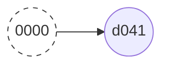

```shell
0000000000000000000000000000000000000000 ## <- 1つ前のコミットハッシュ
d041e090b548f4ab7c11848384f9e171e728fc3d ## <- 自身のコミットハッシュ
SuGit <sgmt.snj@gmail.com> 1626708424 +0900 ## <- コミット情報
commit (initial): initialize repository  ## <- メッセージ
```

<div class="text-lg mt-8">コミット2つ目</div>
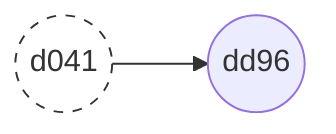

```shell
d041e090b548f4ab7c11848384f9e171e728fc3d
dd96c8f8bbcff86922b3db1f94aa38c4c6f3d633
Sugit <sgmt.snj@gmail.com> 1626710972 +0900
commit: update README.md
```

---
layout: center-image
---

<div class="text-2xl font-bold mb-8">
  コミットは「自身のハッシュ値」と「ひとつ前のハッシュ値」を持ちます
</div>

<div class="text-2xl font-bold mb-4">
git graph はこの連結によって作られます
</div>

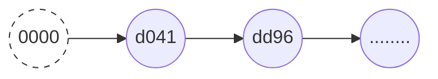

---
layout: center-image
---

<div class="text-3xl font-bold mb-4">
これを踏まえて、いろいろなコマンドをみていきましょう
</div>

---
layout: center-image
---

<div class="text-3xl text-primary font-bold mb-4">
git branch test
</div>

<div class="text-xl">
test ブランチの作成<br>
実態は・・・
</div>

---
layout: center-image
---

<div class="text-3xl font-bold mb-4">
コミットハッシュに名前をつけて保存しただけ
</div>

<div class="text-xl rounded-2xl border-4 border-green-200 p-4 m-8 text-left">
~/.git/refs/heads $ cat test <br>
dd96c8f8bbcff86922b3db1f94aa38c4c6f3d633
</div>


<arrow x1="480" y1="430" x2="450" y2="390" color="#99f" width="2" arrowSize="1" />
test

---
layout: center-image
---

<div class="text-3xl text-primary font-bold mb-4">
git commit --amend -m "hogehoge"
</div>

<div class="text-xl">
コミットの修正は...
</div>


---
layout: center-image
---

<div class="text-3xl font-bold mb-4">
  単に log のファイルを書き換えているだけ
</div>

```shell {3-4}
0000000000000000000000000000000000000000 ## <- 1つ前のコミットハッシュ
d041e090b548f4ab7c11848384f9e171e728fc3d ## <- 自身のコミットハッシュ
SuGit <sgmt.snj@gmail.com> 1626708424 +0900 <-- ここを書き換える
commit (initial): initialize repository <-- ここを書き換える
```

---
layout: center-image
---

<div class="text-3xl text-primary font-bold mb-4">
git merge test
</div>

test ブランチのマージは...?

<br><br>

<v-click>

<div class="text-xl mb-4">
  2パターンに分かれます
</div>

</v-click>

---
layout: center-image
---

<div class="text-xl font-bold m-8">
それぞれのbranchが独自に進化している場合
</div>

main
<arrow x1="520" y1="220" x2="590" y2="260" color="#f99" width="2" arrowSize="1" />
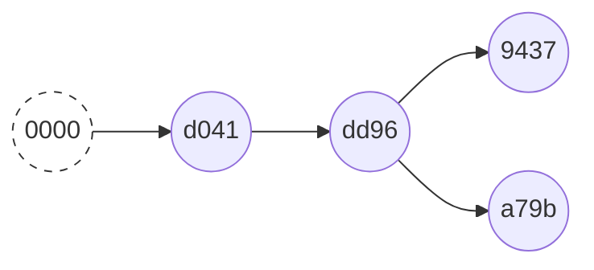
test
<arrow x1="520" y1="420" x2="590" y2="380" color="#99f" width="2" arrowSize="1" />

---
layout: center-image
---

<div class="text-xl font-bold m-8">
マージコミットが増えて main の位置が変わります
</div>

main
<arrow x1="520" y1="220" x2="700" y2="300" color="#f99" width="2" arrowSize="1" />
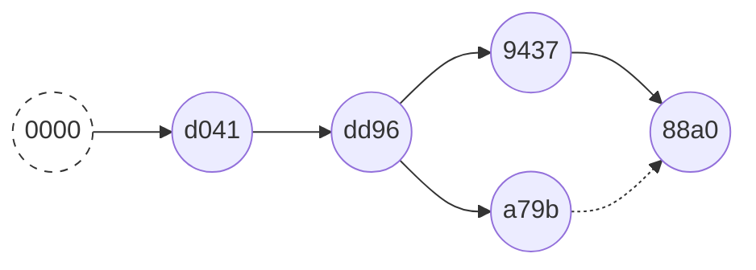
test
<arrow x1="520" y1="420" x2="580" y2="390" color="#99f" width="2" arrowSize="1" />

---
layout: center-image
---

<div class="text-xl font-bold m-8">
testだけが進化している場合
</div>

main
<arrow x1="480" y1="280" x2="520" y2="300" color="#f99" width="2" arrowSize="1" />
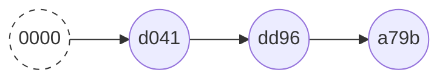
test
<arrow x1="510" y1="370" x2="630" y2="340" color="#99f" width="2" arrowSize="1" />
---
layout: center-image
---

<div class="text-xl font-bold m-8">
git merge しても mainの位置が変わるだけです
</div>

main
<arrow x1="520" y1="270" x2="590" y2="300" color="#f99" width="2" arrowSize="1" />

test
<arrow x1="510" y1="370" x2="590" y2="350" color="#99f" width="2" arrowSize="1" />


---
layout: center-image
---

<div class="text-3xl font-bold m-8">
Git のマージが 2 種類ありますね
</div>

アンケートの内容をやっと回収 🤫

---
layout: center-image
---

<div class="text-2xl text-primary font-bold m-8">
  ① マージコミットが作られる git merge
</div>

<div class="text-2xl text-primary font-bold m-8">
  ② main の位置だけズラす git merge
</div>

---
layout: center-image
---

<div class="text-3xl font-bold m-8">
  どっちが良いんだろう🤨 ??
</div>

---
layout: center-image
---

<div class="text-3xl font-bold m-8">
  ケースバイケース 🤓
</div>

<v-click>

ですが、
<div class="text-3xl font-bold m-8">
  どちらかと言えば ① の方が良い
</div>

</v-click>

---
layout: center-image
---

<div class="text-3xl text-primary font-bold m-8">
  ① non-first-forward
</div>
<div class="text-3xl text-primary font-bold m-8">
  ② first-forward
</div>

といいます

---
layout: center-image
---

<div class="text-3xl font-bold m-8">
  何が違うの？
</div>

---
layout: center-image
---

<div class="text-3xl text-primary font-bold m-8">
  ① non-first-forward
</div>


<div class="text-3xl text-primary font-bold m-8">
  ② first-forward
</div>


---
layout: center-image
---

<div class="text-3xl text-primary font-bold m-8">
  ① non-first-forward
</div>

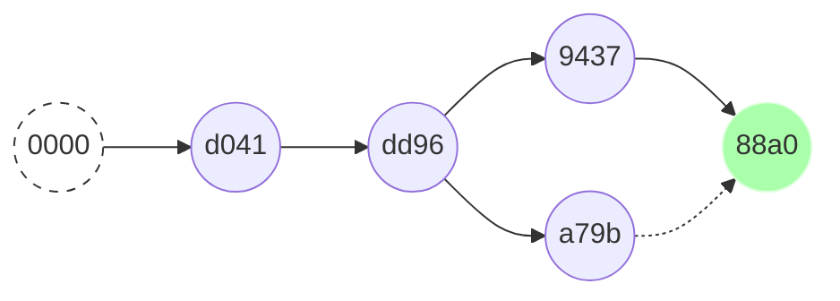

<div class="text-3xl text-primary font-bold m-8">
  ② first-forward
</div>


---
layout: center-image
---

<div class="text-3xl font-bold m-8">
　マージコミットが無い = マージしたぞという "歴史が無い"
</div>

<div class="text-2xl font-bold m-8">
  歴史は大事にしようぜ 😎
</div>


---
layout: center-image
---

<div class="text-4xl font-bold m-8">
  ② は ① にできる 🤗
</div>

---
layout: center-image
---

<div class="text-3xl font-bold m-8">
  --no-ff オプション
</div>

```shell
$ git merge branch-name --no-ff
```

<div class="text-lg m-8">
  これで強制的にマージコミットを積むことができます
</div>

---
layout: center-image
---

<div class="text-3xl font-bold m-8">
  多くの場合、マージコミットは残しておいた方がベターです
</div>

<v-click>

<div class="text-lg m-8">
  ひ○ゆき氏😏 ... <span class="text-3xl">それってあなたの感想ですよね？</span>
</div>

</v-click>

---
layout: center-image
---

<div class="text-3xl font-bold m-8">
  はい、残念ながら私の感想です 😥
</div>

---
layout: center-image
---

<div class="text-2xl font-bold m-8">
  世の中には一定数いるのです。
</div>

<div class="text-2xl font-bold m-8">
　正しい歴史 ＜＜＜ 美しいコミットグラフ 派が...
</div>

---
layout: center-image
---

<div class="text-3xl font-bold m-4">
  コミットグラフの美しさを意識するのは<br>
  OSSにPRを出すときだけで良い!!
  <span class="text-xl font-bold m-4">派です</span>
</div>

OSSコントリビューションのお作法については後ほど 🙌

---
layout: center-image
---

<div class="text-3xl text-primary font-bold mb-4">
	git reset
</div>

これは歴史を書き換える危険なコマンドです ☠️

---
layout: center-image
---

<div class="text-2xl font-bold mb-4">
  👽👽ローカルのコミットを取り消すくらいならOKです👽👽
</div>

<v-click>

<div class="text-3xl font-bold mb-4">
  OKじゃない！！<br>
  めっちゃ注意して！！
</div>

</v-click>

---
layout: center-image
---

<div class="text-2xl font-bold mb-4">
git reset は "まだリモートに入れていない" <br> ローカルのコミットに対してだけ安全です
</div>

コミットはハッシュの連鎖でしたね。

push済みのコミットに対して git reset をするということは、

リモートで既に構築された **コミットの連鎖を破壊する** ってことですね。

---
layout: center-image
---

<div class="text-2xl font-bold">
  あ、"dd96" のコミット、ミスってるわ〜
</div>
<div class="text-2xl font-bold mb-8">
  git reset しよ
</div>

<div class="text-xl text-primary font-bold">
  REMOTE
</div>
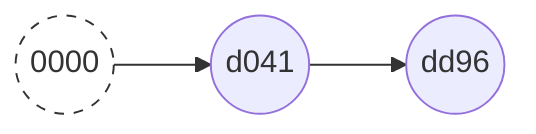

<div class="text-xl text-primary font-bold mt-8">
  LOCAL
</div>
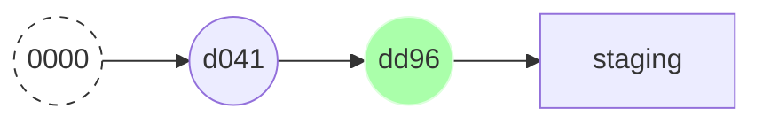

---
layout: center-image
---

<div class="text-2xl font-bold mb-8">
  git reset したったぜ
</div>

<div class="text-xl text-primary font-bold">
  REMOTE
</div>


<div class="text-xl text-primary font-bold mt-8">
  LOCAL
</div>
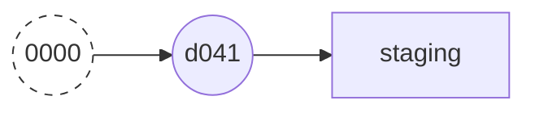

---
layout: center-image
---

<div class="text-2xl font-bold mb-8">
  新しい変更をコミットだ!!
</div>

<div class="text-xl text-primary font-bold">
  REMOTE
</div>


<div class="text-xl text-primary font-bold mt-8">
  LOCAL
</div>
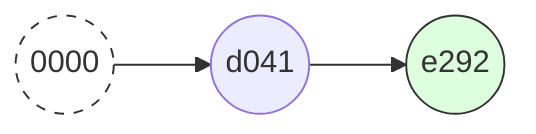

---
layout: center-image
---

<div class="text-2xl font-bold mb-8">
  リモートにプッシュだ.... あれ?!
</div>

<div class="text-xl text-primary font-bold">
  REMOTE
</div>
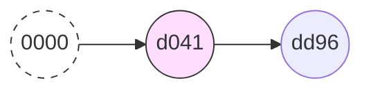

<div class="text-xl text-primary font-bold mt-8">
  LOCAL
</div>
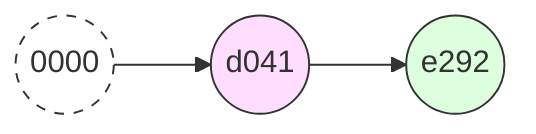

---
layout: center-image
---

<div class="text-2xl font-bold mb-8">
  コミット = 自身のハッシュ + 直前のハッシュ
</div>

---
layout: center-image
---

<div class="text-2xl font-bold m-4">
  ハッシュでつなぐと…
</div>

<div class="text-xl text-primary font-bold">
  REMOTE
</div>
```mermaid
graph LR
  a01((0000))
  a02((d041))
  a03((dd96))
  style a01 fill:#fff,stroke:#333,stroke-width:1px,stroke-dasharray: 5 5
  style a02 fill:#fdf,stroke:#333,stroke-width:1px
  a01 --> a02 --> a03
```

<div class="text-xl text-primary font-bold mt-8">
  LOCAL
</div>
```mermaid
graph LR
  b01((0000))
  b02((d041))
  b03((e292))
  style b01 fill:#fff,stroke:#333,stroke-width:1px,stroke-dasharray: 5 5
  style b02 fill:#fdf,stroke:#333,stroke-width:1px
  style b03 fill:#dfd,stroke:#333,stroke-width:1px
  b01 --> b02 --> b03
```

---
layout: center-image
---

<div class="text-2xl font-bold m-4">
  2つに分離してしまう…
</div>
<div class="text-xl font-bold m-4">
  これは push error
</div>

<div class="text-xl text-primary font-bold">
  REMOTE
</div>

```mermaid
graph LR
  c01((0000))
  c02((d041))
  c03((dd96))
  d03((e292))
  style c01 fill:#fff,stroke:#333,stroke-width:1px,stroke-dasharray: 5 5
  style c02 fill:#fdf,stroke:#333,stroke-width:1px
  style d03 fill:#dfd,stroke:#333,stroke-width:1px
  c01 --> c02 --> c03
  c02 --> d03
```

---
layout: center-image
---

<div class="text-2xl font-bold m-4">
  「push errro 対応」 ググる
</div>
<br>
<div class="text-2xl font-bold m-4">
  git push -f でできるんだって!!
</div>

<v-click>
  <div class="text-2xl font-bold m-4">
    ↑ 犯罪です 👮🏻‍♂️
  </div>
</v-click>

---
layout: center-image
---

<div class="text-3xl font-bold mb-4">
git reset は明らかに push してないことを事前に確認
</div>

<div class="text-xl font-bold mb-4">
よくわからないまま使うと大変なことに…
</div>

---
layout: center-image
---

<div class="text-3xl text-primary font-bold md-4">
	ちょっとコマンド集から脱線して…（後で戻ります）
</div>

---
layout: center-image
---

<div class="text-3xl text-primary font-bold md-4">
	「git push -f した若手を怒るのはやめよう」
  <br>
  について
</div>

※ 適切な指導は必要ですよっ

---
layout: center-image
---

<div class="text-2xl font-bold m-8">
	「今度来た若いのいきなり main に git push -f してさ〜」😤
</div>
<div class="text-2xl font-bold m-8">
	「いや、管理側にも大いに問題あるよそれ」🤨
</div>

---
layout: center-image
---

<div class="text-3xl font-bold m-8">
	大事な branch は設定で守ろう!!
</div>

---
layout: center-image
---

<div class="text-3xl font-bold m-8">
  GitHub Branch Protection
</div>

[🌐 GitHub のブランチ保護ルール](https://docs.github.com/ja/github/administering-a-repository/defining-the-mergeability-of-pull-requests/managing-a-branch-protection-rule) を活用しましょう。

<br>

- CI が通っていないマージは NG
- Approve 必須
- main への直接 push は owner のみ
- などなど

<style>
ul {
  text-align: left;
  list-style-type: circle;
  font-size: 1.3rem;
}
</style>

---
layout: center-image
---

<div class="text-2xl font-bold m-8">
	若手が安心して git を使えるようにしてあげよう 😎
</div>

---
layout: center-image
---

<div class="text-3xl text-primary font-bold md-4">
	では、いろいろなコマンドをみていきましょう（再開）
</div>

---
layout: center-image
---

<div class="text-3xl text-primary font-bold md-4">
	git cherry-pick
</div>

つまみ食いコマンド

---
layout: center-image
---

<div class="text-xl text-primary font-bold">
  BRANCH-A
</div>
```mermaid
graph LR
  c01((a901))
  c02((d041))
  c03((dd96))
  style c03 fill:#dfd,stroke:#333,stroke-width:1px
  c01 --> c02 --> c03
```

<div class="text-xl text-primary font-bold">
  BRANCH-B
</div>
```mermaid
graph LR
  d01((a901))
  d02((d041))
  d03((e292))
  d04((41d2))
  style d03 fill:#aef,stroke:#333,stroke-width:1px
  d01 --> d02 --> d03 --> d04
```

<div class="text-xl font-bold m-8">
  A に B から e292 だけ取り込みたい
</div>

---
layout: center-image
---

<div class="text-xl font-bold m-8">
  git cherry-pick e292...
</div>

<div class="text-xl">
  cherry-pick は 競合しやすいので、我慢して手作業で修正しましょう。
</div>

---
layout: center-image
---

別のブランチで作業したコミットにおける **変更**を 

<span class="text-2xl font-bold">
"別のコミットとして"
</span>
取り込みます。

---
layout: center-image
---

<div class="text-xl font-bold m-8">
e292に対してcherry-pickを実行
</div>

<div class="text-xl text-primary font-bold">
  BRANCH-A
</div>
```mermaid
graph LR
  a01((a901))
  a02((d041))
  a03((dd96))
  style a03 fill:#dfd,stroke:#333,stroke-width:1px
  a01 --> a02 --> a03
```

<div class="text-xl text-primary font-bold">
  BRANCH-B
</div>
```mermaid
graph LR
  b01((a901))
  b02((d041))
  b03((e292))
  b04((41d2))
  style b03 fill:#aef,stroke:#333,stroke-width:1px
  b01 --> b02 --> b03 --> b04
```

---
layout: center-image
---

<div class="text-xl font-bold m-8">
e292からパッチを作って...
</div>

<div class="text-xl text-primary font-bold">
  BRANCH-A
</div>
```mermaid
graph LR
  c01((a901))
  c02((d041))
  c03((dd96))
  style c03 fill:#dfd,stroke:#333,stroke-width:1px
  c01 --> c02 --> c03
```

<div class="text-xl text-primary font-bold">
  BRANCH-B
</div>
```mermaid
graph LR
  d01((a901))
  d02((d041))
  d03((e292))
  d04((41d2))
  style d03 fill:#aef,stroke:#333,stroke-width:1px
  d01 --> d02 --> d03 --> d04
```

```mermaid
graph LR
  e03((e292))
  e05{{patch}}
  style e03 fill:#aef,stroke:#333,stroke-width:1px
  style e05 fill:#aef,stroke:#333,stroke-width:1px
  e03 -- パッチを作る --> e05
```

---
layout: center-image
---

<div class="text-xl font-bold m-8">
mainブランチにパッチを適用してコミットを作る
</div>

<div class="text-xl text-primary font-bold">
  BRANCH-A
</div>
```mermaid
graph LR
  f01((a901))
  f02((d041))
  f03((dd96))
  f04((ae22))
  style f03 fill:#dfd,stroke:#333,stroke-width:1px
  style f04 fill:#aef,stroke:#333,stroke-width:1px
  f01 --> f02 --> f03 --PATCH--> f04
```


---
layout: center-image
---

<br><br>
<div class="text-2xl font-bold">
コミットハッシュが異なるところがポイントです
</div>
<div class="text-2xl font-bold">
e292 != ae22
</div>

<br><br>

<v-click>
  <div class="text-2xl font-bold">
    もしハッシュが一緒だったら??<br>
    何がやばいか考えてみてください 🤔
  </div>
</v-click>

---
layout: center-image
---

<div class="text-xl font-bold">

このコマンドは歴史を書き換えないので安心です
<br>
<br>
リリースコントロールのために使ったり
<br>
<br>
別ブランチで誰かがやった神対応が欲しかったり
<br>
<br>

そんなときにつかいます
</div>

---
layout: center-image
---

<div class="text-3xl text-primary font-bold md-4">
	git stash
</div>

これはめっちゃ使います。

---
layout: center-image
---

新機能の作業用ブランチで作業中...
<br><br>

<div class="text-xl font-bold">
🥸「急で悪いけど、このバグ直して欲しいんや」
</div>

<br>
とか言われた時に
<br><br>

<div class="text-xl font-bold">
🥺「うぅぅぅ・・・まだコミットしたくないんだよなぁ・・」
</div>

<br>ということがあります。

そんなときに git stash です。

---
layout: center-image
---

- git stash save
- git stash list
- git stash apply
- git stash drop
- git stash pop (apply して drop する)

<style>
ul {
  text-align: left;
  list-style-type: circle;
  font-size: 1.3rem;
}
</style>

---
layout: center-image
---

<div class="text-3xl text-primary font-bold md-8">
	git rebase
</div>

ちょっと危険なヤツ

ちゃんと理解しておこう

---
layout: center-image
---

rebase はあるブランチのコミットを
別のブランチの歴史につなげます

topic で rebase してみましょう

```mermaid
graph LR
  d01((a311))
  d02((92fb))
  d03((e21b))
  d04((52b1))
  e01((31c2))
  e02((8a24))
  d01 --> d02 --> d03 --> d04
  d03 --> e01 --> e02
  subgraph main
    d04
  end
  subgraph topic
    e02
  end
```

---
layout: center-image
---

同じ変更を<span class="font-bold">別のコミット</span>に変換して、繋げます（ハッシュが異なる）

```mermaid
graph LR
  d01((a311))
  d02((92fb))
  d03((e21b))
  d04((52b1))
  d05((8ab2))
  d06((c1be))
  e01((31c2))
  e02((8a24))
  d01 --> d02 --> d03 --> d04 --> d05 --> d06
  d03 --> e01 --> e02
  e01 -.-> d05
  e02 -.-> d06
  subgraph main
    d04
  end
  subgraph topic
    d06
  end
  style e01 fill:#fff,stroke:#333,stroke-width:1px,stroke-dasharray: 5 5
  style e02 fill:#fff,stroke:#333,stroke-width:1px,stroke-dasharray: 5 5
```

---
layout: center-image
---

rebase 後は一直線になります

```mermaid
graph LR
  d01((a311))
  d02((92fb))
  d03((e21b))
  d04((52b1))
  d05((8ab2))
  d06((c1be))
  d01 --> d02 --> d03 --> d04 --> d05 --> d06
  subgraph main
    d04
  end
  subgraph topic
    d06
  end
```

---
layout: center-image
---
<div class="text-xl">
平行線の歴史を一直線にすることができます

つまり、<span class="font-bold">「歴史を書き換えます」</span>

リモートへの影響は常に意識しましょう（何度でも言います）
</div>

---
layout: center-image
---

<div class="text-3xl font-bold">
git rebase はいつ使うのか？
</div>

---
layout: center-image
---

<div class="text-3xl font-bold mb-16">
OSS への Pull Requestのときです
</div>

<div class="text-2xl">
main へのマージ前にするケースもあるようです。
<br>
これは組織の方針に合わせてください。
</div>

<br><br>
私はあまりしません🙄

---
layout: center-image
---


<div class="text-3xl font-bold mb-8">
レビュワーの気持ちになろう
</div>

<div class="text-xl">
PRを受け取ったら、そのPRはちょっと昔のコミットから生えていた。

😑「おいおい、マージすんの俺かよ・・・」

🤪「だるいし PR 断ろ www」
</div>

<br><br>
というのが割とあります。

事前にリベースして、コンフリクトのないPRを作りましょう。

---
layout: center-image
---
<div class="text-xl mb-8">
  ありのままの歴史を残すことは大切です
  <br><br>
  でも、OSSの場合は、

  <span class="text-2xl font-bold">歴史の管理者は自分ではありません</span>

  いくらコントリビューターと言えども、配慮が必要です。
</div>

---
layout: center-image
---

<div class="text-3xl text-primary font-bold md-4">
	git commit --squash
</div>

複数のコミットを1つにまとめる

---
layout: center-image
---

<div class="text-2xl font-bold md-4">
  コミットが細かくバラバラと切られたPRは<br>なかなかレビューが大変です
</div>
<br><br>
<div class="text-xl md-4">
  レビュアーの気持ちになって、 1 Issue - 1 Commit を心がけましょう。<br>
  でも、作業中は細かくコミットしておきたい。<br>
  そんな時は squash でまとめましょう
</div>

---
layout: center-image
---

<div class="text-2xl font-bold md-4">
  git merge --squash topic
</div>
```mermaid
graph LR
  c01((0000))
  c02((d041))
  c03((dd96))
  c04((9437))
  c05((a79b))
  c06((88a0))
  style c01 fill:#fff,stroke:#333,stroke-width:1px,stroke-dasharray: 5 5
  c01 --> c02 --> c03 --> c04
  c03 --> c05
  c05 --> c06
```
これを…
```mermaid
graph LR
  d01((0000))
  d02((d041))
  d03((dd96))
  d04((9437))
  d05((a79b))
  d06((88a0))
  d07((b1d9))
  style d01 fill:#fff,stroke:#333,stroke-width:1px,stroke-dasharray: 5 5
  style d05 fill:#fff,stroke:#333,stroke-width:1px,stroke-dasharray: 5 5
  style d06 fill:#fff,stroke:#333,stroke-width:1px,stroke-dasharray: 5 5
  style d07 fill:#aef,stroke:#333,stroke-width:1px
  d01 --> d02 --> d03 --> d04 --> d07
  d03 --> d05 --> d06
```
こう

---
layout: center-image
---

<div class="text-2xl font-bold">
せっかく OSS へ PR を投げる話になったので、

コントリビューションマナーについて紹介します
</div>


---
layout: center-image
---

<div class="text-3xl font-bold m-8">
まずこれを読む
</div>

https://github.com/github/opensource.guide

<br><br>

https://opensource.guide/how-to-contribute/


---
layout: center-image
---

<div class="text-3xl font-bold">
  この記事がとてもよかったので引用して紹介します
</div>

<div class="flex align-center justify-center">
  
</div>

https://qvault.io/open-source/contributing-to-open-source/

---
layout: center-image
---

<div class="text-3xl font-bold">
  👕 Tシャツ事件をご存知だろうか...
</div>

---
layout: center-image
---

<div class="text-3xl font-bold mb-8">
  👕 Tシャツ事件
</div>

Hacktoberfest という団体がやったイベントで

"なんでもいいから OSS に PR を4つ作ったらTシャツあげます!!"

が事件を起こしました

---
layout: center-image
---

<div class="text-6xl font-bold mb-8">
  残念な PR の大量発生💩
</div>

---
layout: center-image
---

<div class="text-6xl font-bold mb-8">
  憤怒するOSSメンテナー🤬
</div>

---
layout: center-image
---

<div class="text-3xl font-bold">
  ちなみにこの記事はこの事件がきっかけで生まれました
</div>

<div class="flex align-center justify-center">
  
</div>

---
layout: center-image
---

<div class="text-3xl font-bold">
  6 Things to Avoid When Contributing to OSS
</div>

- Pull Requests Should Handle ONE Thing
- Don't Break Consistency
- Don't Start Work Without Approval
- Don't Re-Open Known Problems/Solutions
- Squash Those Commits
- Be Meaningful

<style>
ul {
  text-align: left;
  list-style-type: decimal;
  font-size: 1.3rem;
}
</style>

---
layout: center-image
---

<div class="text-3xl text-primary font-bold mb-4">
  1. Pull Requests Should Handle ONE Thing
</div>

<div class="text-2xl">
  PRでは1つのトピックに関するもののみ
</div>

<br><br>
<div class="text-xl">
<v-click>

  バグAを修正したよ

  ついでに xxx の書き方が非効率だったから直してやったぜ

</v-click>

<v-click>

<br><br>
<div class="text-3xl">
  いやぁぁぁぁぁぁ！！！😱
</div>

</v-click>

</div>

---
layout: center-image
---

<div class="text-3xl text-primary font-bold mb-4">
  2. Don't Break Consistency
</div>

<div class="text-2xl">
  一貫性を守ること （空気を読んでくれ…）
</div>

<br><br>
<div class="text-xl">
  コーディングスタイルを守って欲しい、ということです。
</div>

---
layout: center-image
---

<div class="text-3xl text-primary font-bold mb-4">
  3. Don't Start Work Without Approval
</div>

<div class="text-2xl">
  急にPR送ってこないで…

  まずは Issue たてて、コミュニケーションとってからやで…
</div>


---
layout: center-image
---

<div class="text-3xl text-primary font-bold mb-4">
  4. Don't Re-Open Known Problems/Solutions
</div>

<div class="text-2xl">
  Issue立てる前に似たIssueが既に無いか確認しておいてや…
</div>


---
layout: center-image
---

<div class="text-3xl text-primary font-bold mb-4">
  5. Squash Those Commits
</div>

<div class="text-2xl">
  PR内のコミットは squash でまとめておいて欲しい…
</div>

---
layout: center-image
---

<div class="text-3xl text-primary font-bold mb-4">
  6. Be Meaningful
</div>

<div class="text-2xl">
  なるべく意義のある提案をして欲しい
</div>

<div class="text-xl">
  そんなんどうでもええねん！！って言わさないで欲しいということ。
</div>

---
layout: center-image
---

<div class="text-3xl text-primary font-bold mb-4">
  いいコントリビューションはいい Issue から
</div>


<div class="text-xl">
  コントリビューションマナーを見ると、Issue の大切さがよくわかると思います

  良い Issue を目指しましょう
</div>


---
layout: center-image
---

<div class="text-3xl text-primary font-bold mb-4">
  Issue を立てる時に気をつけることチェックリスト
</div>

- Issue の重複はなるべくやめて…
- 感想？観測？どっち？
- テンプレート使ってよ… 🥺
- 情報が少なすぎる
- タイトルから中身が分からない

<style>
ul {
  text-align: left;
  list-style-type: decimal;
  font-size: 1.3rem;
}
</style>

---
layout: center-image
---

<div class="text-3xl text-primary font-bold mb-4">
  1. Issue の重複はなるべくやめて…
</div>

完璧でなくて良いですが、似た Issue が無いかなるべく検索しましょう。

もし見落としても怒られないので、あくまで親切心で😊

---
layout: center-image
---

<div class="text-3xl text-primary font-bold mb-4">
  2. 感想？観測？どっち？
</div>

Edge のときに XX っていうエラーがでます!!

(... Safari, Chrome, Firefox 確認してない)

これが感想

正しくは 

「XXっていうエラーが出ます。私の環境は Edge です。」

---
layout: center-image
---

<div class="text-3xl text-primary font-bold mb-4">
  3. テンプレート使ってよ… 🥺
</div>

Issue のテンプレートが用意されている場合があります。なるべく探しましょう。

<br>

📄 bug_report.md
```md
## Steps to Reproduce
1. Run `flutter create bug`.
2. Update the files as follows: ...
3. ...

**Expected results:**

**Actual results:**

Logs...
```

参考: https://github.com/flutter/flutter/issues/59842
---
layout: center-image
---

<div class="text-3xl text-primary font-bold mb-4">
  4. 情報が少なすぎる
</div>

<div class="text-xl">
5W1H を意識して書こうね
</div>

---
layout: center-image
---

<div class="text-3xl text-primary font-bold mb-4">
  5. タイトルから中身が分からない
</div>

<div class="text-xl">
TITLE:「コンポーネントAでエラーが出る」
</div>

なんの？

---
layout: center-image
---

<div class="text-3xl text-primary font-bold mb-4">
  最後のトピック
</div>

---
layout: center-image
---

<div class="text-3xl text-primary font-bold mb-4">
  Git flow について
</div>


---
layout: center-image
---

<div class="text-3xl font-bold mb-4">
  Gitっていろんなことができるんだなぁ 😗
</div>

---
layout: center-image
---

<div class="text-3xl font-bold mb-4">
  そう、いろいろできるんです
</div>

<v-click>

  <div class="text-3xl font-bold mb-4">
    できちゃうんです… 😇
  </div>

</v-click>

---
layout: center-image
---

<div class="text-2xl font-bold mb-4">
  運用ルールがない<span class="text-red-400">無法地帯Gitプロジェクト</span>は本当に危険です
</div>

---
layout: center-image
---

<div class="text-3xl font-bold mb-4">
  作ろう運用ルール 👨🏻‍🔧
</div>

---
layout: center-image
---

<div class="text-3xl font-bold mb-4">
  有名な運用ルールに習おう

  それが "Git flow"
</div>


---
layout: center-image
---

<div class="text-3xl text-primary font-bold mb-4">
  Git flow
</div>

<v-click>


<div class="text-xl text-primary font-bold mb-4">
<br>
<i class="light-icon-brand-github"></i> GitHub flow

<i class="light-icon-brand-gitlab"></i> GitLab flow

<br>
という派生もありますよ
</div>

</v-click>

---
layout: image-right
image: 'https://nvie.com/img/git-model@2x.png'
equal: false
---

<div class="text-3xl text-primary font-bold mb-4">
  Git flow
</div>
<div class="text-2xl font-bold mb-4">
  A Successful Git Branching Model
</div>

https://nvie.com/posts/a-successful-git-branching-model/

---
layout: center-image
---

<div class="text-2xl font-bold m-8">
  拡大!!
</div>
<div class="flex align-center justify-center">
  
</div>

---
layout: center-image
---

<div class="text-2xl font-bold mb-4">
  Branch
</div>

- **master (main)** : 製品リリース版のブランチ。リリースに合わせてTagをつける。
- **develop** : 開発ブランチ。リリース前の最新情報はここにある状態にする。
- **feature** : 追加機能、バグ修正などの小テーマごとに用意するブランチ。
- **release** : リリース直前（develop以上、master以下）の微調整作業用ブランチ。
- **hotfix** : masterブランチで発生した緊急修正用のブランチ。

<style>
ul {
  text-align: left;
  list-style-type: circle;
  font-size: 1.3rem;
}
</style>

---
layout: center-image
---

<div class="text-3xl font-bold mb-4">
  え、、ややこし… 😦
</div>

---
layout: center-image
---

<div class="text-2xl font-bold mb-4">
  私もそう思います
  <br><br>
  一方で、とてもよくできた運用でもあります
</div>
<div class="text-xl font-bold mb-4">
  <br>
  「知って使わない」と「知らない」は大違いなのでぜひ覚えておいてください
</div>

---
layout: center-image
---

<div class="text-3xl font-bold mb-4">
  そこで、私の推奨はこちら
</div>
<div class="text-3xl text-primary font-bold mb-4">
  人が頑張るのはもうやめよう
</div>

---
layout: center-image
---

<div class="text-3xl font-bold mb-4">
  細かすぎるルールはだいたい上手くいかない
</div>

私が業務で扱っているリポジトリは100人近くのメンバーが参加しています。

優秀な人材が集まろうが、<span class="text-red-500 text-xl">ルールの徹底など不可能</span>です 😭


---
layout: center-image
---

<div class="text-2xl font-bold mb-4">
  Git flow が提唱されたのが 2010年です
</div>

<div class="text-2xl font-bold mb-4">
  GitHubのリリースとおよそ同時期ですね
</div>


---
layout: center-image
---

<div class="text-2xl font-bold mb-4">
  10年あればソフトウェア業界は別世界になります
</div>

- 10年前 : よく考えられたルールに準じて運用しよう
- 現代 : 全てのルールは人ではなく、システムで担保する

<style>
ul {
  text-align: left;
  list-style-type: circle;
  font-size: 1.3rem;
}
</style>

---
layout: center-image
---

<div class="text-2xl font-bold mb-4">
  ルールはシステムで担保する時代
</div>

<v-click>

<div class="text-4xl text-primary font-bold mb-4">
  CI/CD の時代!!
</div>

</v-click>

---
layout: center-image
---

<div class="text-3xl font-bold mb-4">
  CI/CD はありとあらゆる組織（個人開発含め）で

  なるべく早い段階で導入することを

  強くお勧めします（経験に基づく）
</div>

保険と同じ。何かあってからでは遅いのです。

---
layout: intro
image: "https://source.unsplash.com/collection/94734566/1920x1080"
---

<div class="mb-4 absolute bottom-16 left-12">
  <div class="text-9xl text-white text-opacity-80" style="font-weight:600;" >
    Git  <light-icon icon="git-branch"/>
  </div> 
  <span class="text-6xl text-primary-lighter text-opacity-80" style="font-weight:500;" >
    と仲良くなれましたか?
  </span>
</div>

